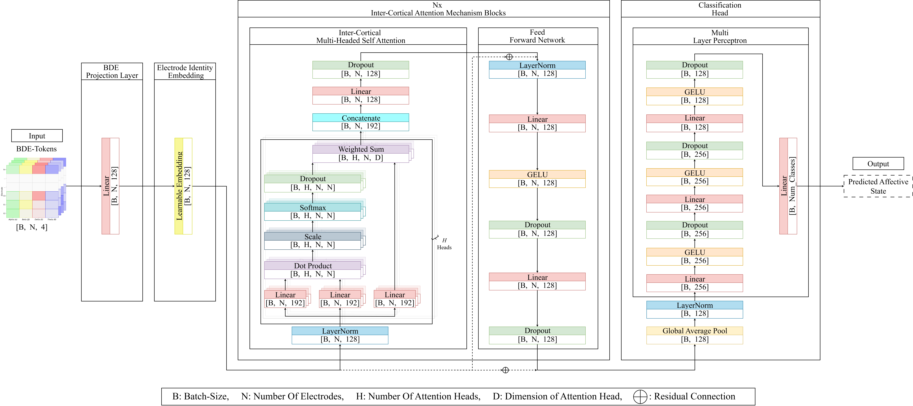
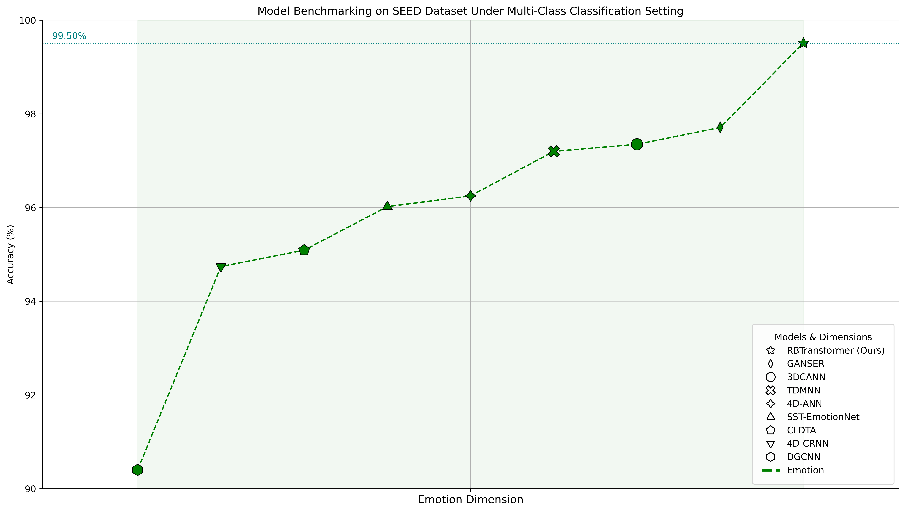
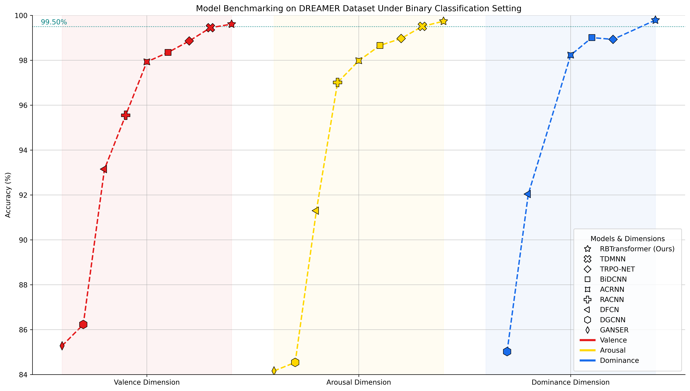
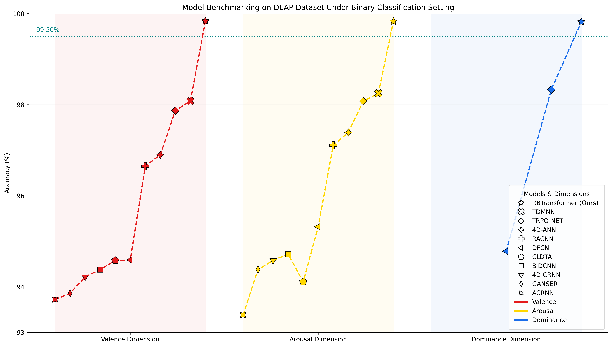
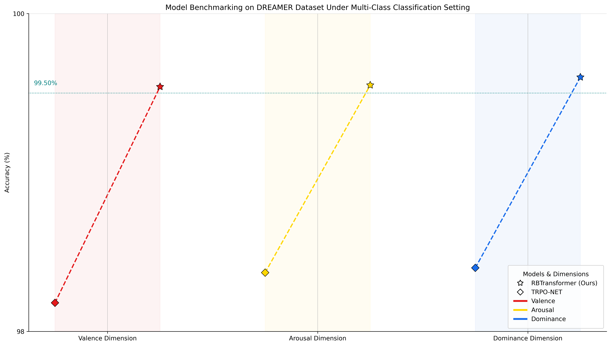
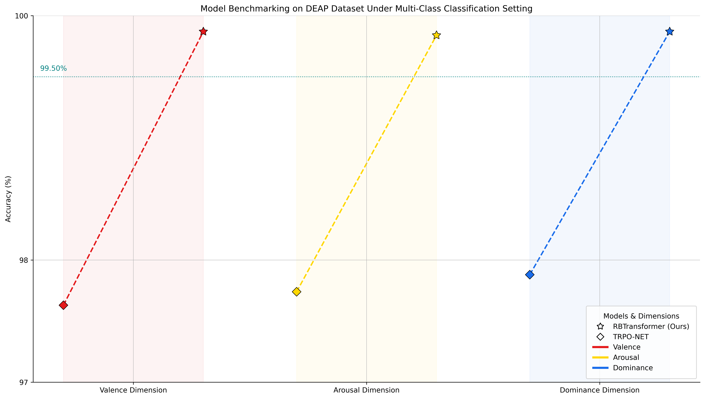
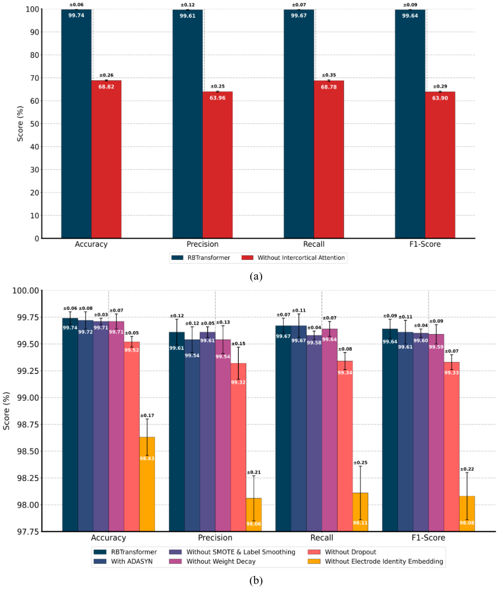

<h1 align="center"><i>RBTransformer</i></h1>

<p align="center"><strong>Official PyTorch codebase of RBTransformer from our paper:<br>
<em>“A Brain Wave Encodes a Thousand Tokens: Modeling Inter-Cortical Neural Interactions for Effective EEG-Based Emotion Recognition”</em></strong></p>

## 1. OVERVIEW
<p align="center">
  
</p>
<p align="center"><sub><em><b>Figure 1.</b> Model Architecture of RBTransformer</em></sub></p>
Abstract - Human emotions are difficult to convey through words and are often abstracted in the process; however, electroencephalogram (EEG) signals can offer a more direct lens into emotional brain activity. Recent studies show that deep learning models can process these signals to perform emotion recognition with high accuracy. However, many existing approaches overlook the dynamic interplay between distinct brain regions, which can be crucial to understanding how emotions unfold and evolve over time, potentially aiding in more accurate emotion recognition. To address this, we propose RBTransformer, a Transformer-based neural network architecture that models inter-cortical neural dynamics of the brain in latent space to better capture structured neural interactions for effective EEG-based emotion recognition. First, the EEG signals are converted into Band Differential Entropy (BDE) tokens, which are then passed through Electrode Identity embeddings to retain spatial provenance. These tokens are processed through successive inter-cortical multi-head attention blocks that construct an electrode x electrode attention matrix, allowing the model to learn the inter-cortical neural dependencies. The resulting features are then passed through a classification head to obtain the final prediction. We conducted extensive experiments, specifically under subject-dependent settings, on the SEED, DEAP, and DREAMER datasets, over all three dimensions, Valence, Arousal, and Dominance (for DEAP and DREAMER), under both binary and multi-class classification settings. The results demonstrate that the proposed RBTransformer outperforms all previous state-of-the-art methods across all three datasets, over all three dimensions under both classification settings.

## 2. INSTALLATION, REQUIREMENTS AND SETUP 

To get started, first clone the repository from GitHub:

```bash
git clone https://github.com/nnilayy/RBTransformer.git
```

Then navigate into the project folder and install dependencies:

```bash
cd RBTransformer
pip install -r requirements.txt
```

> The codebase requires **Python 3.10 or higher**.

To ensure scripts run correctly across environments, set the `PYTHONPATH` to the root of the project:

* **For Linux/macOS:**

  ```bash
  export PYTHONPATH=$(pwd)
  ```

* **For Windows:**

  ```powershell
  $env:PYTHONPATH = (Get-Location).Path
  ```

* **For Notebooks:**

  ```python
  import os
  os.environ['PYTHONPATH'] = os.getcwd()
  ```

## 3. SCRIPTS

### I. PREPROCESSING DATASETS SCRIPTS

RBTransformer is evaluated on three benchmark EEG datasets: SEED, DEAP, and DREAMER along their respective affective dimensions, for both Binary and Multi-Class Classification tasks.

<p align="center">
  
</p>
<p align="center"><sub><em><b>Figure 2.</b> Preprocessing Pipeline for RBTransformer</em></sub></p>

As illustrated in Figure 2, the preprocessing pipeline handles the full data transformation—from raw EEG signals to baseline-corrected BDE tokens—tailored for all 13 prediction tasks. Once processed, the datasets are saved as `.pkl` files inside the `preprocessed_datasets/` directory and are used directly during training. The table below summarizes all 13 preprocessed dataset files, categorized by Dataset, Dimension, and Task Type:

| #  | Dataset | Task Type                   | Dimension | Output File                            |
| -- | ------- | --------------------------- | --------- | -------------------------------------- |
| 1  | SEED    | Multi-Class Classification  | Emotion   | `seed_multi_emotion_dataset.pkl`       |
| 2  | DEAP    | Multi-Class Classification  | Valence   | `deap_multi_valence_dataset.pkl`       |
| 3  | DEAP    | Multi-Class Classification  | Arousal   | `deap_multi_arousal_dataset.pkl`       |
| 4  | DEAP    | Multi-Class Classification  | Dominance | `deap_multi_dominance_dataset.pkl`     |
| 5  | DEAP    | Binary-Class Classification | Valence   | `deap_binary_valence_dataset.pkl`      |
| 6  | DEAP    | Binary-Class Classification | Arousal   | `deap_binary_arousal_dataset.pkl`      |
| 7  | DEAP    | Binary-Class Classification | Dominance | `deap_binary_dominance_dataset.pkl`    |
| 8  | DREAMER | Multi-Class Classification  | Valence   | `dreamer_multi_valence_dataset.pkl`    |
| 9  | DREAMER | Multi-Class Classification  | Arousal   | `dreamer_multi_arousal_dataset.pkl`    |
| 10 | DREAMER | Multi-Class Classification  | Dominance | `dreamer_multi_dominance_dataset.pkl`  |
| 11 | DREAMER | Binary-Class Classification | Valence   | `dreamer_binary_valence_dataset.pkl`   |
| 12 | DREAMER | Binary-Class Classification | Arousal   | `dreamer_binary_arousal_dataset.pkl`   |
| 13 | DREAMER | Binary-Class Classification | Dominance | `dreamer_binary_dominance_dataset.pkl` |

To generate the 13 preprocessed datasets, run the following scripts:

```bash
python dataset_classes/deap_preprocessing.py
```

This preprocesses the DEAP dataset across valence, arousal, and dominance dimensions for both binary-class classification (3 `.pkl` files) and multi-class classification (3 `.pkl` files), totaling 6 `.pkl` files.

```bash
python dataset_classes/dreamer_preprocessing.py
```

This preprocesses the DREAMER dataset across valence, arousal, and dominance dimensions for both binary-class classification (3 `.pkl` files) and multi-class classification (3 `.pkl` files), totaling 6 `.pkl` files.

```bash
python dataset_classes/seed_preprocessing.py
```

This preprocesses the SEED dataset across the sole emotion dimension for multi-class classification, resulting in 1 `.pkl` file.


### II. TRAINING SCRIPTS

RBTransformer was evaluated on the SEED, DEAP, and DREAMER datasets across their affective dimensions, emotion for SEED, and valence, arousal, dominance for DEAP and DREAMER, for both Binary and Multi-Class classification settings.

To train and replicate the results of RBTransformer as indicated in the paper, run the following script with the given configuration options:

```bash
python train.py \
  --root_dir <ROOT_DIR> \
  --dataset <DATASET> \
  --task_type <TASK_TYPE> \
  --dimension <DIMENSION> \
  --seed 23 \
  --device cuda \
  --num_workers 4 \
  --hf_username <HF_USERNAME> \
  --hf_token <HF_TOKEN> \
  --wandb_api_key <WANDB_API_KEY>
```

Replace the following:

* `<ROOT_DIR>`: Path to the folder containing the preprocessed `.pkl` file. Default: `preprocessed_datasets`

* `<DATASET>`: Name of the dataset to train on. Options: `seed`, `deap`, `dreamer`

* `<TASK_TYPE>`: Type of classification task. Options: `binary`, `multi`

* `<DIMENSION>`: Affective dimension to predict.

  * For `seed`: `emotion`
  * For `deap` or `dreamer`: `valence`, `arousal`, `dominance`

* `<HF_USERNAME>`: Your Hugging Face username (used for model uploads)

* `<HF_TOKEN>`: Your Hugging Face access token (needed to authenticate and push models)

* `<WANDB_API_KEY>`: Your Weights & Biases API key (for logging training metrics)

### III. ABLATION SCRIPTS

RBTransformer was ablated on the DREAMER dataset along the Arousal dimension for Binary Classification tasks.

To replicate these ablation experiments, use the scripts provided under the `ablations/` directory. Each folder corresponds to a specific ablation setting.

```bash
python ablations/<ABLATION_NAME>/train.py \
  --root_dir <ROOT_DIR> \
  --seed 23 \
  --device cuda \
  --num_workers 4 \
  --hf_username <HF_USERNAME> \
  --hf_token <HF_TOKEN> \
  --wandb_api_key <WANDB_API_KEY>
```

Replace the following:

* `<ABLATION_NAME>`: Name of the ablation to run. Choose one of:

  * `with-adasyn`
  * `without-dropout`
  * `without-electrode-identity-embedding`
  * `without-intercortical-attention`
  * `without-smote-and-label-smoothing`
  * `without-weight-decay`

* `<ROOT_DIR>`: Path to the folder containing the preprocessed DREAMER binary arousal `.pkl` file. By default, this is `preprocessed_datasets/`.

* `<HF_USERNAME>`: Your Hugging Face username (used for model uploads)

* `<HF_TOKEN>`: Your Hugging Face access token (needed to authenticate and push models)

* `<WANDB_API_KEY>`: Your Weights & Biases API key (for logging training metrics)


## 4. W&B: EXPERIMENT LOGS

All training and ablation runs were logged using Weights & Biases, across all 5 folds of their respective experiments. The logged training configurations, evaluation metrics, and system details for all 13 training runs and 6 ablation runs can be accessed using the links below.

### I. TRAINING LOGS

| #  | Dataset | Task Type                   | Dimension | W\&B Project Link                                                                                                                                       |
| -- | ------- | --------------------------- | --------- | ------------------------------------------------------------------------------------------------------------------------------------------------------- |
| 1  | SEED    | Multi-Class Classification  | Emotion   | [View Logs](https://wandb.ai/nnilayy/%CE%B1-rbtransformer-eeg-recognition-seed-multi-emotion-class-classification-sota-run-0001?nw=nwusernnilayy)       |
| 2  | DEAP    | Multi-Class Classification  | Valence   | [View Logs](https://wandb.ai/nnilayy/%CE%B1-rbtransformer-eeg-recognition-deap-multi-valence-class-classification-sota-run-0001?nw=nwusernnilayy)       |
| 3  | DEAP    | Multi-Class Classification  | Arousal   | [View Logs](https://wandb.ai/nnilayy/%CE%B1-rbtransformer-eeg-recognition-deap-multi-arousal-class-classification-sota-run-0001?nw=nwusernnilayy)       |
| 4  | DEAP    | Multi-Class Classification  | Dominance | [View Logs](https://wandb.ai/nnilayy/%CE%B1-rbtransformer-eeg-recognition-deap-multi-dominance-class-classification-sota-run-0001?nw=nwusernnilayy)     |
| 5  | DEAP    | Binary-Class Classification | Valence   | [View Logs](https://wandb.ai/nnilayy/%CE%B1-rbtransformer-eeg-recognition-deap-binary-valence-class-classification-sota-run-0001?nw=nwusernnilayy)      |
| 6  | DEAP    | Binary-Class Classification | Arousal   | [View Logs](https://wandb.ai/nnilayy/%CE%B1-rbtransformer-eeg-recognition-deap-binary-arousal-class-classification-sota-run-0001?nw=nwusernnilayy)      |
| 7  | DEAP    | Binary-Class Classification | Dominance | [View Logs](https://wandb.ai/nnilayy/%CE%B1-rbtransformer-eeg-recognition-deap-binary-dominance-class-classification-sota-run-0001?nw=nwusernnilayy)    |
| 8  | DREAMER | Multi-Class Classification  | Valence   | [View Logs](https://wandb.ai/nnilayy/%CE%B1-rbtransformer-eeg-recognition-dreamer-multi-valence-class-classification-sota-run-0001?nw=nwusernnilayy)    |
| 9  | DREAMER | Multi-Class Classification  | Arousal   | [View Logs](https://wandb.ai/nnilayy/%CE%B1-rbtransformer-eeg-recognition-dreamer-multi-arousal-class-classification-sota-run-0001?nw=nwusernnilayy)    |
| 10 | DREAMER | Multi-Class Classification  | Dominance | [View Logs](https://wandb.ai/nnilayy/%CE%B1-rbtransformer-eeg-recognition-dreamer-multi-dominance-class-classification-sota-run-0001?nw=nwusernnilayy)  |
| 11 | DREAMER | Binary-Class Classification | Valence   | [View Logs](https://wandb.ai/nnilayy/%CE%B1-rbtransformer-eeg-recognition-dreamer-binary-valence-class-classification-sota-run-0001?nw=nwusernnilayy)   |
| 12 | DREAMER | Binary-Class Classification | Arousal   | [View Logs](https://wandb.ai/nnilayy/%CE%B1-rbtransformer-eeg-recognition-dreamer-binary-arousal-class-classification-sota-run-0001?nw=nwusernnilayy)   |
| 13 | DREAMER | Binary-Class Classification | Dominance | [View Logs](https://wandb.ai/nnilayy/%CE%B1-rbtransformer-eeg-recognition-dreamer-binary-dominance-class-classification-sota-run-0001?nw=nwusernnilayy) |


The following tables provide a comparison of classification performance between RBTransformer and previously proposed models across the DEAP, DREAMER, and SEED datasets. Results are shown for each affective dimension (Valence, Arousal, Dominance) under both binary and multi-class classification settings, highlighting where RBTransformer performs competitively across tasks.


### *Table I: Binary-Class Classification Performance Comparison on DEAP Dataset*

| Model                    | Valence (%)      | Arousal (%)      | Dominance (%)    |
| ------------------------ | ---------------- | ---------------- | ---------------- |
| ACRNN                    | 93.72 ± 3.21     | 93.38 ± 3.73     | –                |
| GANSER                   | 93.86 ± –        | 94.38 ± –        | –                |
| 4D-CRNN                  | 94.22 ± 2.61     | 94.58 ± 3.69     | –                |
| BiDCNN                   | 94.38 ± 2.61     | 94.72 ± 2.56     | –                |
| CLDTA                    | 94.58 ± 1.40     | 94.11 ± 2.10     | –                |
| DFCN                     | 94.59 ± –        | 95.32 ± –        | 94.78 ± –        |
| RACNN                    | 96.65 ± 2.65     | 97.11 ± 2.01     | –                |
| 4D-ANN                   | 96.90 ± 1.65     | 97.39 ± 1.75     | –                |
| TRPO-NET                 | 97.87 ± 1.89     | 98.08 ± 1.83     | 98.33 ± 1.55     |
| TDMNN                    | 98.08 ± 2.13     | 98.25 ± 2.85     | –                |
| **RBTransformer (Ours)** | **99.84 ± 0.02** | **99.83 ± 0.05** | **99.82 ± 0.06** |


### *Table II: Binary-Class Classification Performance Comparison on DREAMER Dataset*

| Model                    | Valence (%)      | Arousal (%)      | Dominance (%)    |
| ------------------------ | ---------------- | ---------------- | ---------------- |
| GANSER                   | 85.28 ± –        | 84.16 ± –        | –                |
| DGCNN                    | 86.23 ± 12.29    | 84.54 ± 10.18    | 85.02 ± 10.25    |
| DFCN                     | 93.15 ± –        | 91.30 ± –        | 92.04 ± –        |
| RACNN                    | 95.55 ± 2.18     | 97.01 ± 2.74     | –                |
| ACRNN                    | 97.93 ± 1.73     | 97.98 ± 1.92     | 98.23 ± 1.42     |
| BiDCNN                   | 98.35 ± 0.87     | 98.66 ± 1.46     | 99.01 ± 0.96     |
| TRPO-NET                 | 98.86 ± 0.57     | 98.97 ± 0.49     | 98.93 ± 0.69     |
| TDMNN                    | 99.45 ± 0.91     | 99.51 ± 0.79     | –                |
| **RBTransformer (Ours)** | **99.61 ± 0.05** | **99.74 ± 0.06** | **99.79 ± 0.04** |


### *Table III: Multi-Class Classification Performance Comparison on SEED Dataset*

| Model                    | Accuracy (%)     |
| ------------------------ | ---------------- |
| DGCNN                    | 90.40 ± 8.49     |
| 4D-CRNN                  | 94.74 ± 2.32     |
| CLDTA                    | 95.09 ± 4.48     |
| SST-EmotionNet           | 96.02 ± 2.17     |
| 4D-ANN                   | 96.25 ± 1.86     |
| TDMNN                    | 97.20 ± 1.57     |
| 3DCANN                   | 97.35 ± –        |
| GANSER                   | 97.71 ± –        |
| **RBTransformer (Ours)** | **99.51 ± 0.02** |


### *Table IV: Multi-Class Classification Performance Comparison on DEAP Dataset*

| Model                    | Valence (%)      | Arousal (%)      | Dominance (%)    |
| ------------------------ | ---------------- | ---------------- | ---------------- |
| TRPO-NET                 | 97.63 ± 2.38     | 97.74 ± 2.26     | 97.88 ± 2.24     |
| **RBTransformer (Ours)** | **99.87 ± 0.04** | **99.84 ± 0.04** | **99.87 ± 0.05** |


### *Table V: Multi-Class Classification Performance Comparison on DREAMER Dataset*

| Model                    | Valence (%)      | Arousal (%)      | Dominance (%)    |
| ------------------------ | ---------------- | ---------------- | ---------------- |
| TRPO-NET                 | 98.18 ± 0.97     | 98.37 ± 0.93     | 98.40 ± 0.80     |
| **RBTransformer (Ours)** | **99.54 ± 0.06** | **99.55 ± 0.04** | **99.60 ± 0.05** |


> Below are the accuracy plots comparing previous state-of-the-art models with RBTransformer for each dataset under both binary-class and multi-class classification settings across their respective dimensions:

<p align="center">
  
</p>
<p align="center"><sub><b>Figure 3.</b> Model Benchmarking on SEED Dataset Under Multi-Class Classification Setting</sub></p>

<p align="center">
  
</p>
<p align="center"><sub><b>Figure 4.</b> Model Benchmarking on DREAMER Dataset Under Binary Classification Setting</sub></p>

<p align="center">
  
</p>
<p align="center"><sub><b>Figure 5.</b> Model Benchmarking on DEAP Dataset Under Binary Classification Setting</sub></p>

<p align="center">
  
</p>
<p align="center"><sub><b>Figure 6.</b> Model Benchmarking on DREAMER Dataset Under Multi-Class Classification Setting</sub></p>

<p align="center">
  
</p>
<p align="center"><sub><b>Figure 7.</b> Model Benchmarking on DEAP Dataset Under Multi-Class Classification Setting</sub></p>


### II. ABLATION LOGS

| # | Dataset | Task Type                   | Dimension | Ablation                             | W\&B Project Link                                                                                                                                                                     |
| - | ------- | --------------------------- | --------- | ------------------------------------ | ------------------------------------------------------------------------------------------------------------------------------------------------------------------------------------- |
| 1 | DREAMER | Binary-Class Classification | Arousal   | Without Inter-Cortical Attention     | [View Logs](https://wandb.ai/nnilayy/abl-%CE%B1-rbtransformer-eeg-recognition-dreamer-binary-arousal-class-classification-without-intercortical-attention-0001?nw=nwusernnilayy)      |
| 2 | DREAMER | Binary-Class Classification | Arousal   | Without Weight Decay                 | [View Logs](https://wandb.ai/nnilayy/abl-%CE%B1-rbtransformer-eeg-recognition-dreamer-binary-arousal-class-classification-without-weight-decay-0001?nw=nwusernnilayy)                 |
| 3 | DREAMER | Binary-Class Classification | Arousal   | Without SMOTE & Label Smoothing      | [View Logs](https://wandb.ai/nnilayy/abl-%CE%B1-rbtransformer-eeg-recognition-dreamer-binary-arousal-class-classification-without-smote-and-label-smoothing-0001?nw=nwusernnilayy)    |
| 4 | DREAMER | Binary-Class Classification | Arousal   | Without Dropout                      | [View Logs](https://wandb.ai/nnilayy/abl-%CE%B1-rbtransformer-eeg-recognition-dreamer-binary-arousal-class-classification-without-dropout-0001?nw=nwusernnilayy)                      |
| 5 | DREAMER | Binary-Class Classification | Arousal   | Without Electrode Identity Embedding | [View Logs](https://wandb.ai/nnilayy/abl-%CE%B1-rbtransformer-eeg-recognition-dreamer-binary-arousal-class-classification-without-electrode-identity-embedding-0001?nw=nwusernnilayy) |
| 6 | DREAMER | Binary-Class Classification | Arousal   | With ADASYN                          | [View Logs](https://wandb.ai/nnilayy/abl-%CE%B1-rbtransformer-eeg-recognition-dreamer-binary-arousal-class-classification-with-adasyn-0001?nw=nwusernnilayy)                          |

Below is the bar plot visualization of the ablation results:

<p align="center">
  
</p>
<p align="center"><sub><em><b>Figure 8.</b> Ablation study for binary classification on the DREAMER dataset (Arousal dimension). Top: Impact of Inter-Cortical Attention. Bottom: Impact of training, regularization, and model components including Electrode Identity Embedding, ADASYN, SMOTE with label smoothing, weight decay, and dropout.</em></sub></p>

## 5. HUGGING FACE: MODEL CHECKPOINTS

Similarly, all trained and ablated model checkpoints were saved on Hugging Face across all 5 folds of their respective experiments. The full set of pretrained weights—including fold-specific model checkpoints—for all 13 training runs and 6 ablation configurations can be accessed using the links below.

### I. TRAINED MODEL CHECKPOINTS

| #  | Dataset | Task Type                   | Dimension | Hugging Face Collection Link                                                                                                             |
| -- | ------- | --------------------------- | --------- | ---------------------------------------------------------------------------------------------------------------------------------------- |
| 1  | SEED    | Multi-Class Classification  | Emotion   | [View Model Collection](https://huggingface.co/collections/nnilayy/rbtransformer-seed-multi-class-classification-weights-685405050ad35ac2317bb718) |
| 2  | DEAP    | Multi-Class Classification  | Valence   | [View Model Collection](https://huggingface.co/collections/nnilayy/rbtransformer-deap-multi-valence-weights-68540512f2302718187e6b73)              |
| 3  | DEAP    | Multi-Class Classification  | Arousal   | [View Model Collection](https://huggingface.co/collections/nnilayy/rbtransformer-deap-multi-arousal-weights-68846a68bff5773cc32c0cbc)              |
| 4  | DEAP    | Multi-Class Classification  | Dominance | [View Model Collection](https://huggingface.co/collections/nnilayy/rbtransformer-deap-multi-dominance-weights-68846a7c5087ab57d5f49746)            |
| 5  | DEAP    | Binary-Class Classification | Valence   | [View Model Collection](https://huggingface.co/collections/nnilayy/rbtransformer-deap-binary-valence-weights-68540522f92909b9c5fa1bab)             |
| 6  | DEAP    | Binary-Class Classification | Arousal   | [View Model Collection](https://huggingface.co/collections/nnilayy/rbtransformer-deap-binary-arousal-weights-68846aa0f6d5858363d80e9e)             |
| 7  | DEAP    | Binary-Class Classification | Dominance | [View Model Collection](https://huggingface.co/collections/nnilayy/rbtransformer-deap-binary-dominance-weights-68846a94a4a33706a17c37f6)           |
| 8  | DREAMER | Multi-Class Classification  | Valence   | [View Model Collection](https://huggingface.co/collections/nnilayy/rbtransformer-dreamer-multi-valence-weights-68846b1dce02622a9167336a)           |
| 9  | DREAMER | Multi-Class Classification  | Arousal   | [View Model Collection](https://huggingface.co/collections/nnilayy/rbtransformer-dreamer-multi-arousal-weights-685405310a8788a07fac2357)           |
| 10 | DREAMER | Multi-Class Classification  | Dominance | [View Model Collection](https://huggingface.co/collections/nnilayy/rbtransformer-dreamer-multi-dominance-weights-68846cfdce02622a916787df)         |
| 11 | DREAMER | Binary-Class Classification | Valence   | [View Model Collection](https://huggingface.co/collections/nnilayy/rbtransformer-dreamer-binary-valence-weights-68846af11784581c5aca0999)          |
| 12 | DREAMER | Binary-Class Classification | Arousal   | [View Model Collection](https://huggingface.co/collections/nnilayy/rbtransformer-dreamer-binary-arousal-weights-6854053ec1a6746032c2fc18)          |
| 13 | DREAMER | Binary-Class Classification | Dominance | [View Model Collection](https://huggingface.co/collections/nnilayy/rbtransformer-dreamer-binary-dominance-weights-68846af96b4462ce01d72be9)        |

### II. ABLATION MODEL CHECKPOINTS

| # | Dataset | Task Type                   | Dimension | Ablation                             | Hugging Face Collection Link                                                                                                                 |
| - | ------- | --------------------------- | --------- | ------------------------------------ | -------------------------------------------------------------------------------------------------------------------------------------------- |
| 1 | DREAMER | Binary-Class Classification | Arousal   | Without Inter-Cortical Attention     | [View Model Collection](https://huggingface.co/collections/nnilayy/abl-w-o-ic-attention-rbtransformer-dreamer-binary-arousal-68860757036423affcdcb951) |
| 2 | DREAMER | Binary-Class Classification | Arousal   | Without Weight Decay                 | [View Model Collection](https://huggingface.co/collections/nnilayy/abl-w-o-weight-decay-rbtransformer-dreamer-binary-arousal-6886068d12825c3fe6347b8f) |
| 3 | DREAMER | Binary-Class Classification | Arousal   | Without SMOTE & Label Smoothing      | [View Model Collection](https://huggingface.co/collections/nnilayy/abl-w-o-smote-and-ls-rbtransformer-dreamer-binary-arousal-688606fbe630a45168f0d1e3) |
| 4 | DREAMER | Binary-Class Classification | Arousal   | Without Dropout                      | [View Model Collection](https://huggingface.co/collections/nnilayy/abl-w-o-dropout-rbtransformer-dreamer-binary-arousal-68860644ede5d03681f341b7)      |
| 5 | DREAMER | Binary-Class Classification | Arousal   | Without Electrode Identity Embedding | [View Model Collection](https://huggingface.co/collections/nnilayy/abl-w-o-eie-rbtransformer-dreamer-binary-arousal-68860734f0f7573b8ed81c87)          |
| 6 | DREAMER | Binary-Class Classification | Arousal   | With ADASYN                          | [View Model Collection](https://huggingface.co/collections/nnilayy/abl-with-adasyn-rbtransformer-dreamer-binary-arousal-688605f7581ba118ab5ff380)      |


## 6. INVERSE LOGARITHMIC STABILITY SCORE (ILSS)

To assess a model's stability and consistency across cross-validation folds, in our paper we introduce a new metric: Inverse Logarithmic Stability Score (ILSS). ILSS jointly considers both the mean accuracy and the standard deviation of performance across folds, rewarding models that are not only accurate but also consistently reliable. It penalizes high variance and offers a bounded score between 0 and 10 to reflect the model’s reliability and stability across different data splits.

$$
\text{ILSS} = \frac{\sqrt{\mu}}{10} \cdot \min\left(-\log_{10} \left( \frac{\sigma}{1 + \lambda \cdot \mu^{2.5}} + \varepsilon \right), 10 \right)
$$

Where:

* $\mu$ = Mean accuracy across folds (in %),
* $\sigma$ = Standard deviation of accuracy across folds,
* $\lambda = 71$ (stability scaling factor),
* $\varepsilon = 10^{-10}$ (for numerical stability).

To calculate the ILSS score for a model, use the following code snippet by providing its mean accuracy and standard deviation:

```python
from ilss.metric import ILSS

ilss = ILSS()
score = ilss.compute(mean_accuracy=99.96, std_dev=0.02)

print(score)
```

We evaluated RBTransformer alongside previously proposed state-of-the-art models on the DREAMER dataset, along the Arousal dimension, for the binary classification setting. The resulting ILSS values for each model are plotted below to reflect their cross-fold stability and consistency.

<p align="center">
  
</p>
<p align="center"><sub><em><b>Figure 11.</b> ILSS scores of RBTransformer and previous state-of-the-art models on the DREAMER dataset (Arousal dimension, Binary Classification). Higher scores indicate greater fold-wise reliability and consistency.</em></sub></p>


## 7. VISUALIZATIONS

To aid interpretability, we visualize both the learned feature representations and the model’s prediction behavior using t-SNE and confusion matrices.

<p align="center">
  
</p>
<p align="center"><sub><em><b>Figure 9.</b> t-SNE visualization of RBTransformer’s latent feature space showing clear emotion-based clustering.</em></sub></p>

<p align="center">
  
</p>
<p align="center"><sub><em><b>Figure 10.</b> Confusion matrix illustrating prediction breakdown and misclassification patterns across emotion classes.</em></sub></p>


## 8. CITATION


This work is published as an **arXiv preprint** and is currently under **peer review for IEEE Transactions on Affective Computing (TAC)**. If you would like to cite our paper, please use the following BibTeX entry: 

```bibtex
@misc{kumar2025brainwaveencodesthousand,
      title={A Brain Wave Encodes a Thousand Tokens: Modeling Inter-Cortical Neural Interactions for Effective EEG-based Emotion Recognition},
      author={Nilay Kumar and Priyansh Bhandari and G. Maragatham},
      year={2025},
      eprint={2511.13954},
      archivePrefix={arXiv},
      primaryClass={q-bio.NC},
      url={https://arxiv.org/abs/2511.13954},
}
```
 